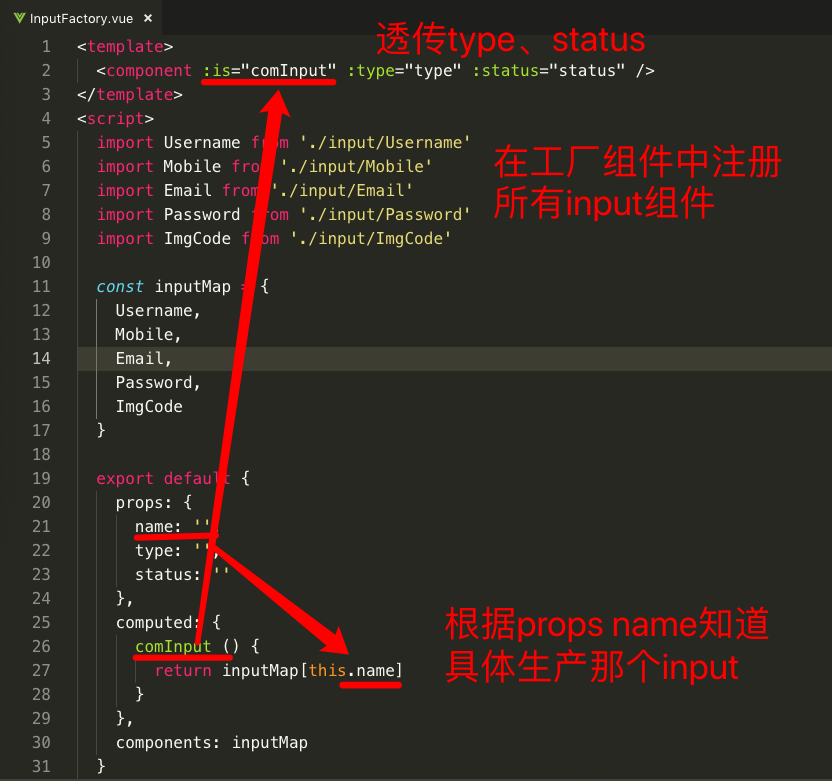
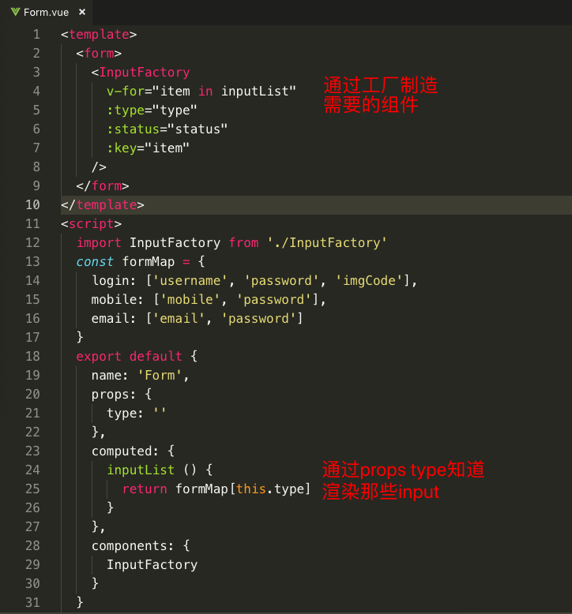

### 需求

`假设：我现在要将登陆、手机注册、邮箱注册通过一个路由用参数type标识渲染那个表单；登陆过程中如果账号密码输入错误次数超过3次就需要输入图像验证码，通过codeStatus进行标识。`

#### 优化一

`既然有三个表单我们就封装三个form组件，每个组件负责自己的渲染逻辑(只是将代码分成三个文件而已，至于优化还谈不上，只是代码的美化)`

#### 优化二（外观模式）

`在优化一的基础上将每个input也组件化，每个input组件接受type、status两个属性，form以组件的形式使用input，这样我们对input的修改会自动更新到所有引用了的form，input是否显示的逻辑在input组件内部有自己控制`

#### 优化三（工厂模式）

#### 外观模式

`外观模式：为子系统中的一组接口提供一个一致的界面，Facade模式定义了一个高层接口，这个接口使得这一子系统更加容易使用。引入外观角色之后，用户只需要直接与外观角色交互，用户与子系统之间的复杂关系由外观角色来实现，从而降低了系统的耦合度`
